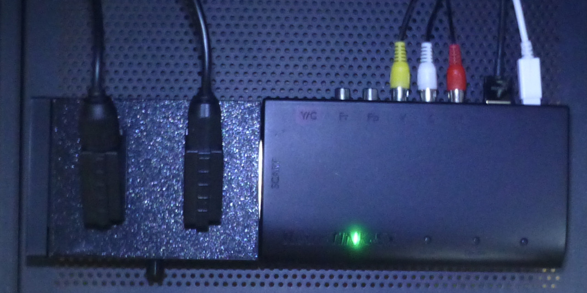

[English README is here](README.md)

# Simple SCART Switch

これは、2つのSCART入力を切り替えることができる切替器です。

AliExpressで1000円以下で販売されている安価なSCART切替器は、コンポジットのみの対応でRGBには対応していません。 
RGBに対応したSCART切替器の多くは必要以上に入力端子の数が多いため、場所をとる上に高価です。 
そこで、RGBに対応した2入力のシンプルな切替器を設計しました。

## 作り方

### 必要な部品

- SCARTプラグ 2個
    - https://ja.aliexpress.com/item/1005006514947794.html
- SCARTソケット 2個
    - https://ja.aliexpress.com/item/1005007196215986.html
- スイッチ (8PDT, 1 Row) 1個
    - https://ja.aliexpress.com/item/4000353452952.html
    - https://www.amazon.co.jp/dp/B0D8HYP276
- ナベ小ネジ (M3, 6～15mm) 2個
- ナベ小ネジ (M3, 8～15mm) 4個
- クッションゴム 4個

### 基板の発注

基板メーカーのサイトで gerber.zip をアップロードし、基板を発注してください。 
JLCPCBの場合、「Remove Order Number」から「Yes」を選択することをお勧めします。

### ケースの印刷

top.stl, bottom.stl, plug_cap.stl を3Dプリンタで印刷してください。 
スイッチにキャップが付属していない場合は switch_cap.stl も印刷してください。

### 組み立て

1. SCARTプラグのピンと基板の間に紙を挟み、SCARTプラグをセロハンテープ等で仮止めしてください。
2. SCARTプラグの両端のピンを半田付けしてください。
3. テープと紙を取り外し、SCARTプラグの残りのピンを半田付けしてください。
4. スイッチを半田付けしてください。
5. SCARTソケットを半田付けしてください。
6. 基板を2本のネジでケースに固定してください。
7. 4本のネジでケースを閉じてください。
8. 底面の四隅にクッションゴムを貼ってください。

## 使い方

- 左右どちらかのプラグを出力先の機器に接続してください。 
  (左右両方のプラグを同時に使用しないでください。) 
  RetroTINK-5X Proに接続する場合は右側のプラグを、RetoTINK-4K Proに接続する場合は左側のプラグを使用することで、配線の向きを揃えることができます。
- 使用しない方のプラグにキャップを被せてください。
- 上面のソケットにゲーム機等の入力ソースを接続してください。
- 前面のスイッチで入力を切り替えることができます。

